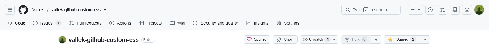

# Github Compact+
Compact Github style + distinctive centered tabs and other tweaks

## Before / After

## Features
* Smaller vertical paddings
* Smaller buttons
* Distinctive tabs with borders
* Tabs are centered
* Turns muted text color of commits and other repo info back to normal
* Dark theme support

## Other styles support
* [GitHub-Dark](https://github.com/StylishThemes/GitHub-Dark)

## Known problems

* After they broke tabs UI layout (29.06.2026) I had to use `:has` css selector. It should work on [modern browsers](https://caniuse.com/css-has). Let me know if you have an issue.

If you found any problem please create an issue!

[Support me of boosty](https://boosty.to/vallek) if you like this style)